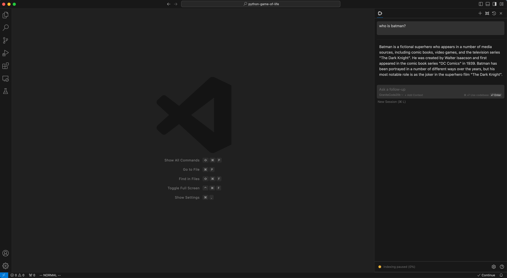
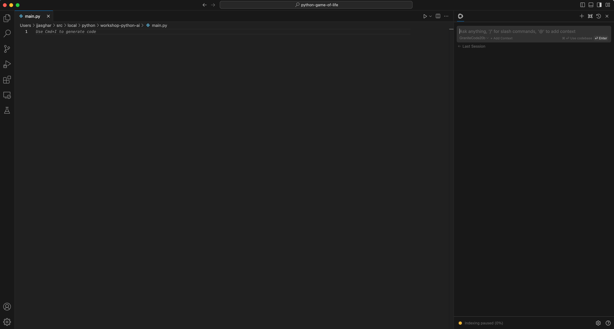
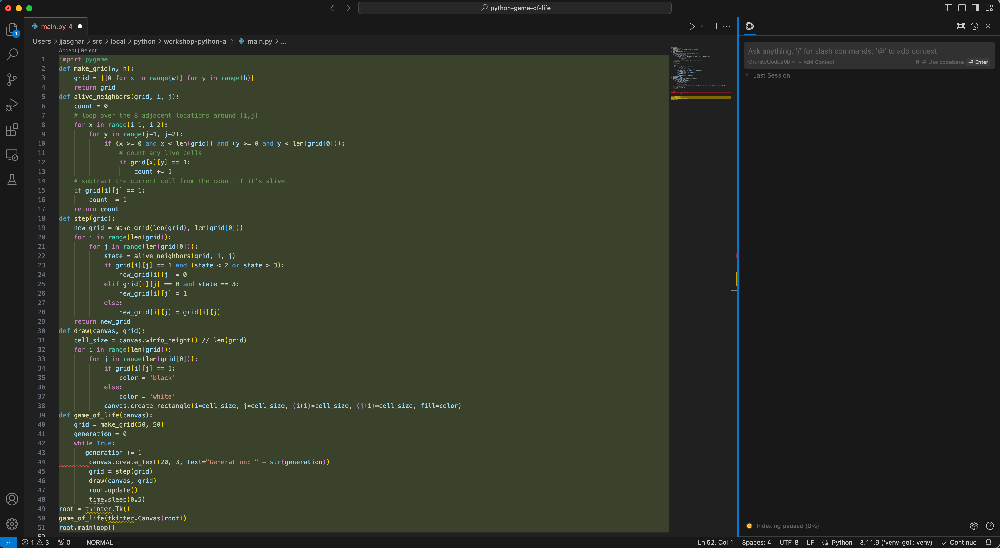
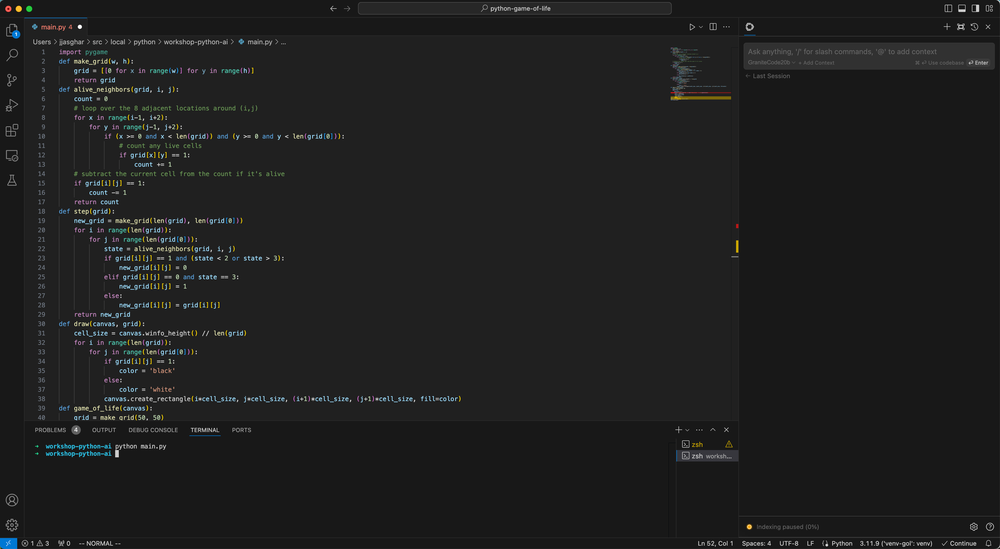
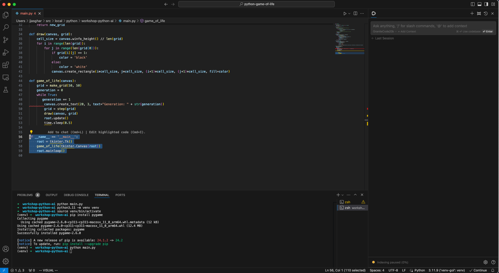
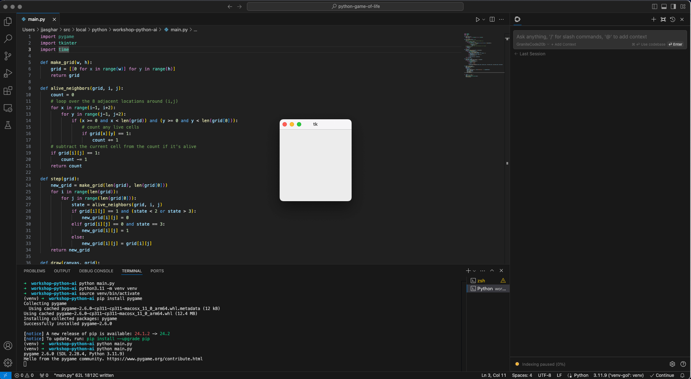
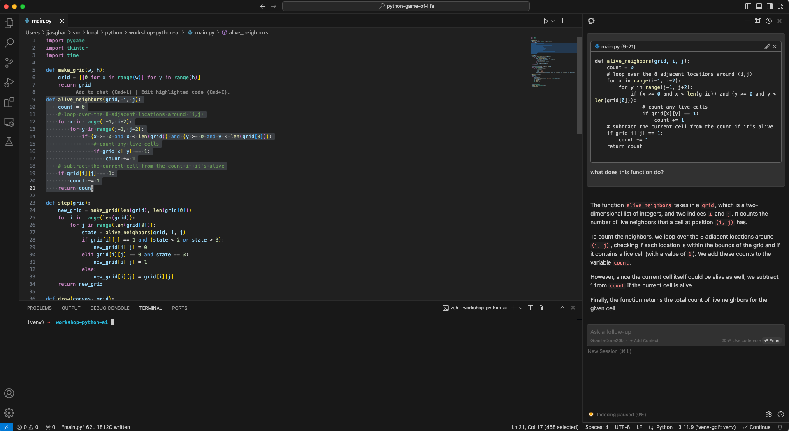
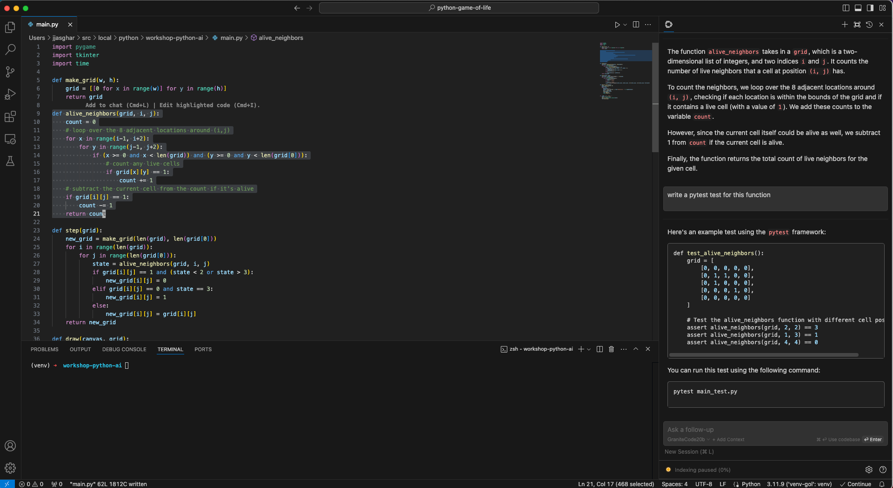
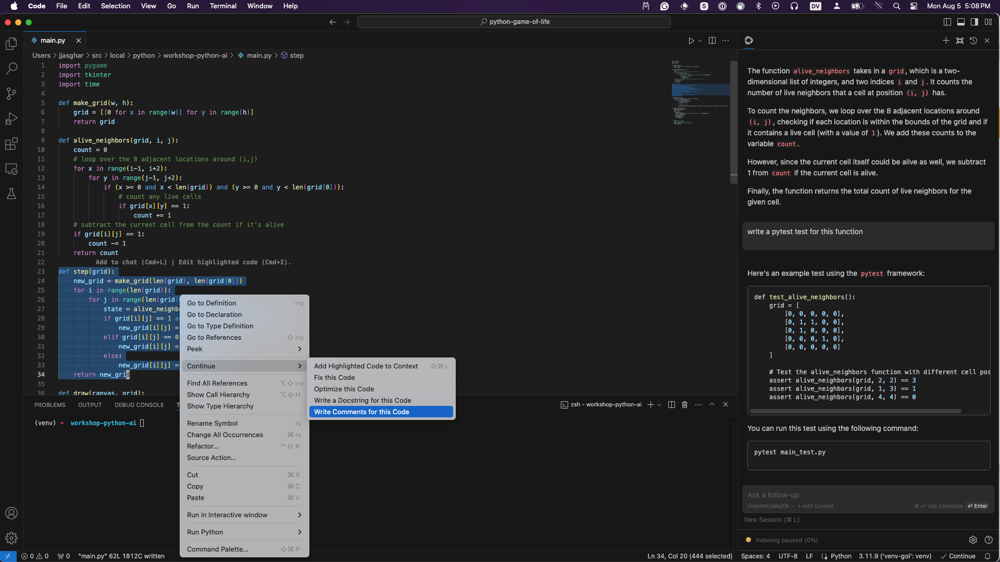

# Using a local AI

Lets play with our new found local AI Open Source AI!

## Sanity checks

When you open up `continue` inside of VSCode it should look something like:


Before we go any farther, write in "Who is batman?" to verify that `ollama`,
VSCode, and `continue` are all working correctly.

!!! troubleshooting
    If Continue is taking a long time to respond, restart Visual Studio Code. If that doesn't resolve your issue, restart Ollama.

If you would like to go deeper with continue, take a look at the [official Continue.dev how-to guide]( https://docs.continue.dev/how-to-use-continue).

Now that we have our local AI co-pilot with us, let's start using it. Now these
next examples are going to be focused on `python` but there is nothing stopping
you from doing this exact same process with `go`, `javascript`, `rust`, or the
like. Part of learning about leveraging this technology is finding the boarders
of its skill sets, and hopefully walking through this you'll understand that
this technology is there to support you, not _do_ your work.

Now, lets open up VSCode and have it look something like the following:


## Building out `main.py`

Now create a new file, and put it in a new directory. Normally it's `ctrl-n` or `command-n` call it
`main.py`.

This is where you should probably "clear" the context window, so either use `ctrl-l` or `command-l` so
your context is clear like the example here:


Now use the `command-i` or `ctrl-i` to open up the `generate code` command palette, and write in:
```
write me out conways game of life using pygame
```

Now granite-code should start giving you a good suggestion here, it should look something like:


!!! note
    It won't be the same will it? That is expected, but you should notice that it's _close_.


## Reading AI generated code

Now what have you noticed here? Try to run it...does it work? Wait, why are there errors in this code?

This is an important lesson for using _any_ AI co-pilot code assistants. They can give you the "lions share"
of what you need, but it won't get you across the finish line. It gives you that "second pair of eyes" and provides
something to work with, but not everything you need.

Don't believe me? Bring up the terminal and attempt to run this code after you accepting it.



Well that isn't good is it? Yours may be different code, or maybe it does work, but at least in this
example we need to to get it fixed.

## First pass at debugging

I'll run the following commands to build up an virtual environment, and install some modules, lets
see how far we get.

```bash
python3.11 -m venv venv
source venv/bin/activate
(venv) pip install pygame
```

Well better, I think, but nothing still happens. So even noticing the `import pygame` tells me I need to
debug farther. There's a few paths here, personally I'm going to take this code, and clean it up a bit
so it's more readable.

## Cleaning up the AI generated code

!!! note
    You can try using the built-in autocomplete and code assistant functions to generate any missing code. In our example, we're missing a "main" entry point to the script. Try hitting `cmd/ctrl + I` again, and typing in something like: "write a main function for my game that plays twenty rounds of Conway's game of life using the `board()` function". What happens?

Cleaning up the code. Now everything is smashed together, it's hard to read the logic here, so first
thing first, going to break up the code and add a `def main` function so I know what the entry point is.

On my version, I had a `tkinter` section, I decided to put the main game loop there:
```python
if __name__ == '__main__':
    root = tkinter.Tk()
    game_of_life(tkinter.Canvas(root))
    root.mainloop()
```

But above it, it seems there's a red squiggly! Remember all I added was some line breaks to for readability,
so another problem this AI gave me, so I need to resolve this too.



For me, all I had to do was remove those extra spaces, but I'd be curious to know what your AI gave you...

## Second pass at debugging

Now that I've clean it up, and it seems I had to do some importing:

```python
import tkinter
import time
```
I can at least run my application now:


But that doesn't work right?! OK, lets start debugging more. This next step is to leverage Granite-Code to
tell me whats going on with the different functions. Go ahead and highlight any _one_ of them and run:
`ctrl-L` or `command-L` to add it to the context window and ask granite-coder something like

```
what does this function do?
```



Pretty good right? It helped me understand what is actually happening with this and I do it with each
function so I get a better understanding of what the program is doing.

Go ahead and walk through your version, see the logic, and who knows maybe it'll highlight why yours
isn't working yet, or not, the next step will help you even more!

## Automagicly creating tests!

One of the most powerful/helping stream line your workflow as a developer is writing good tests
around your code. It's a safety blanket to help make sure your custom code has a way to check for
any adverse changes in a day, week, month, year down the line. Most people hate writing tests,
turns out Granite-Code can do it for you!

That function you recently put in the context window? How about you ask it this:

```text
write a pytest test for this function
```

Now I got a good framework for a test here:


Notice that it only knew about what is in the context, so yep I'll need to add `pip install pytest` to
my project. I'll also need to create a new test file and integrate `pytest` into my project. But
this highlights you not blindly taking from the AI, you need to put it _in_ your system.

Admittedly, if you have trouble building out tests though this is insanely powerful, and your
futureself and team mates will be happy you've built these in.

Finally there are two other things we should mention before heading over to the next Lab. First,
hopefully you've gotten your Game of Life working, if not, a lot of us are Python developers,
raise your hand and one of us may be able to come help you out.

## Automagically commenting your code

Last but not least, there is a great auto comment code option that we'd be remiss not to mention,
take a look at the next screen shot:



It does some amazing work for you code, and really finally, take a look at [this video](https://www.youtube.com/watch?v=V3Yq6w9QaxI) if you want a quick video of other neat https://continue.dev functions we didn't go over.

On to the next lab!


