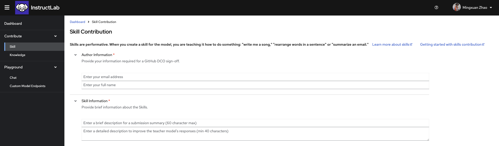
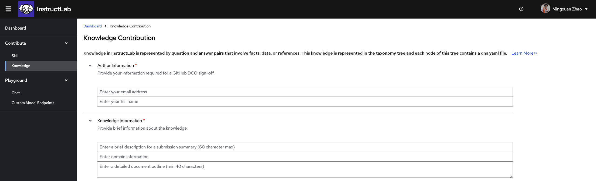

# Using the InstructLab UI

Now that you've run InstructLab locally, let's try contributing to the Open-Source project using the [InstructLab UI](https://qa.ui.instructlab.ai/)

## Verify Access

If you are not part of the InstructLab organization already, you will need to request access using your GitHub username
through this [link](https://instructlab-inviter-instructlab-public-inviter.qa-ui-instructlab-ai-0e3e0ef4c9c6d831e8aa6fe01f33bfc4-0000.us-south.containers.appdomain.cloud/)

You will then be able to login the [InstructLab UI](https://qa.ui.instructlab.ai/) using GitHub SSO

## Chatting with Model

Through the UI, you will have access to the chat function. Like the chat through the CLI, this will allow you to chat with the model
to see if the model has the knowledge/skill you are looking for. Unlike the CLI version, this will give you the opportunity to chat
with a full Granite-7B model, giving you a better understanding of what capabilities the model already has.

You can navigate to this Chat by going the menu on the left-hand side -> Playground dropdown -> Chat:

From here try asking it some questions! If you are able to find a knowledge or skill the model is not yet capable of, we can move on to the next steps and create contributions.

## Creating a Skill Contribution

If you have found a missing skill in granite chat, you can create a skill contribution easily through the UI. Remember, a guide to help you learn about what a Skill is can be found in the [InstructLab Github](https://github.com/instructlab/taxonomy/blob/main/docs/SKILLS_GUIDE.md)

Navigate to the Contribute section of the sidebar and click Skill. Here you will see the form to contribute a Skill to the open-source taxonomy tree.

On this page you will find all the necessary pieces to fill in to create you Skill contribution, let's go through each one here

### Author Information
Use your GitHub account email address and full name here. This will make sure that this contribution and the data with it is properly signed off and credited to you.

### Skill Information
In the box for the submission summary, give a brief description of what your skill is. This will be used in the PR description after you submit.
Below that you will fill in a detailed description of what your skill is teaching the model to do.
For example, if your skill is extracting the date from a bean count ledger, you would fill in "Teaching the model to extract the date from a bean count ledger"

!!! note
    The detailed description is very important for quality synthetic data generation. What you fill in for this box will be used as prompting during the SDG process. Imagine you are telling the teacher model: "The task is (your description here)"

### Taxonomy Directory Path
Using the dropdown menu, you will be able to select where you think your skill will fit the best in the taxonomy tree. If your skill is a grounded skill (meaning that it requires context to answer) you will need to navigate into the "grounded" section of the taxonomy tree before selecting the proper subsection. Otherwise, select the section you think best represents the subject of your skill.

!!! note
    Proper placement within the taxonomy tree will allow other users to more accurately locate existing leaf nodes. Ask yourself: "What section of the library would I expect to find my skill under?"

### Seed Examples
Here you will begin filling out your QNA examples that represent the skill you are trying to teach. You will need a minimum of 5 seed examples, which each example consisting of a Question and Answer. If your skill is a grounded skill and requires context, you will also add context for each QNA pair here.

!!! note
    The QNA pairs that you create here should be diverse. You should try to rephrase questions in different ways and create unique contexts. For example, in the case of date extraction from bean count, you do not want to use the same date repeatedly in your seed examples, as this may have the unintended consequence of teaching the model to simply regurgitate the same date when asked any date extraction question.

### Attribution Information
The information filled in this section will create the attribution.txt file needed for your submission. Fill in a concise title for your skill. If your skill is entirely self created, you can put your name as the creator and use Apache-2.0 as the license. Otherwise please refer to your source material for creator and licensing information.

Once you have filled in all the necessary information, you can finally submit your skill! If you would like to download or view the qna.yaml or attribution.txt, there are drop down menus provided for both. If you choose to, you can download these files to create a PR in the taxonomy repository yourself. Otherwise, you can press submit and the UI will automatically create a PR under your GitHub namespace in the InstructLab Taxonomy repository.

## Creating a Knowledge Contribution

If you have found missing knowledge in granite chat, you can create a knowledge contribution easily through the UI. Remember, a guide to help you learn about what Knowledge is can be found in the [InstructLab Github](https://github.com/instructlab/taxonomy/blob/main/docs/KNOWLEDGE_GUIDE.md)

Firstly you will need to find a source document for your knowledge. Accepted sources can be found [here](https://github.com/instructlab/taxonomy/blob/main/docs/KNOWLEDGE_GUIDE.md#accepted-knowledge)

Navigate to the Contribute section of the sidebar and click Knowledge. Here you will see the form to contribute Knowledge to the open-source taxonomy tree.

On this page you will find all the necessary pieces to fill in to create you knowledge contribution, let's go through each one here

### Author Information
Use your GitHub account email address and full name here. This will make sure that this contribution and the data with it is properly signed off and credited to you.

### Knowledge Information
In the box for the submission summary, give a brief description of what your knowledge is. This will be used in the PR description after you submit.
Below that you will fill in the domain the knowledge you are adding would fall under. For example, if you want to teach the model the winners at the 2024 Olympics, you might put "Olympic history" as the domain.

!!! note
    The task domain is a critical part of the SDG process and will be part of the prompt when generating synthetic data. Ask your self: "What kind of textbook would contain the knowledge I am trying to teach the model?"

The final box in Knowledge Information will contain an outline of the document. Using the example above, you may put "Document listing the medalists in the 2024 Summer Olympics"

### Taxonomy Directory Path
Using the dropdown menu, you will be able to select where you think your knowledge will fit the best in the taxonomy tree.

!!! note
    Proper placement within the taxonomy tree will allow other users to more accurately locate existing leaf nodes. Ask yourself: "What section of the library would I expect to find my skill under?"

### Seed Examples
Here you will begin filling out your QNA examples that represent the knowledge you are trying to teach. There must be exactly 5 seed examples in this section. Each seed example needs one unique piece of context from your source document with no more than 500 characters. From this piece of context, you will need to create 3 QNA pairs that can be answered from the context you have selected.

### Document
You will now need to upload the source document for your knowledge submission here. If you choose to automatically upload, summitting the file will automatically create a repo in your GitHub namespace with the markdown document and generate the link to the repo in your knowledge submission. Otherwise, you can manually enter the details of where your knowledge document is located.

!!! note
    Your knowledge document must be place in a public GitHub repo in order to be accepted. When your submission is being reviewed and merged, this document will need to be accessible publicly.

### Attribution Information

Lastly you will fill in the attribution information. For a Wikipedia article, this means you will need the Title of the article, URL to the article, and Document Revision link to the article. The license for Wikipedia articles will be "CC-BY-SA-4.0" and Creator Name can simply be "Wikipedia Authors"
